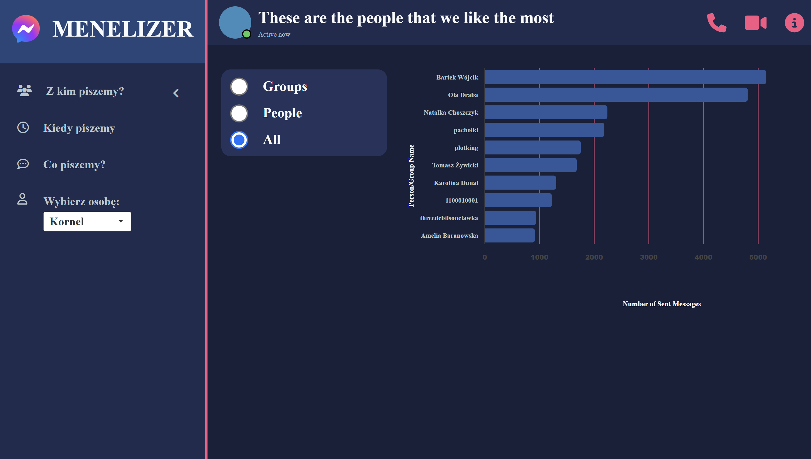
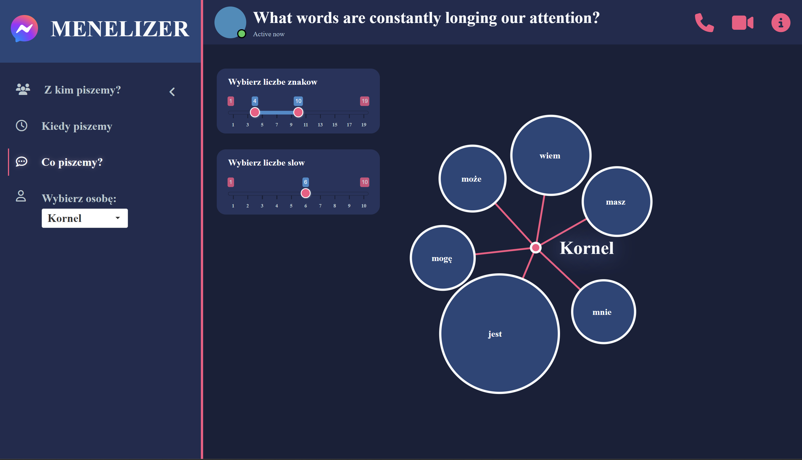

# projectMe

Messenger data visualisation dashboard for Data Visualization Techniques course in the second year of Data Science studies at the Warsaw University of Technology. The aim was to prepare interactive dashboard which presents data analysis about authors. We chose data from messaging app - Messenger and visualized them in shiny dashboard.

To see the app click
**[here](https://fylypo.shinyapps.io/SpotifyApp/)**.

### Authors
[KornelTlaczala](https://github.com/korneltlaczala) [@MichalZajaczkowski](https://github.com/Zajaczkowskim) [@MateuszDeptuch](https://github.com/DeptuchMateusz)

### Main panel

  

### Other panels

  

